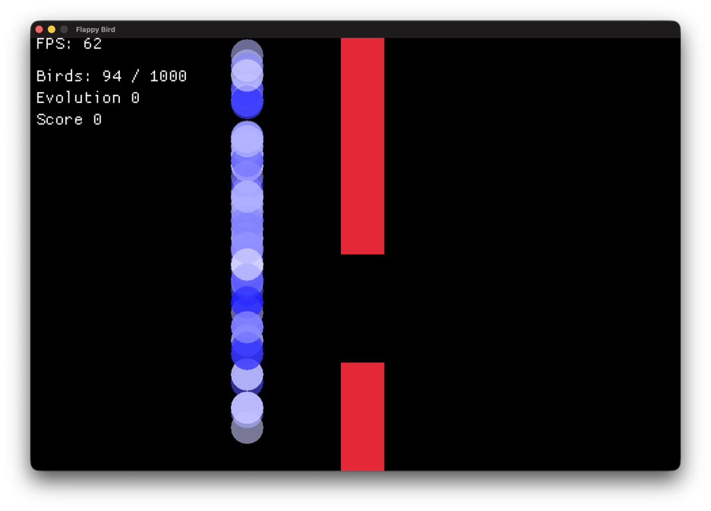
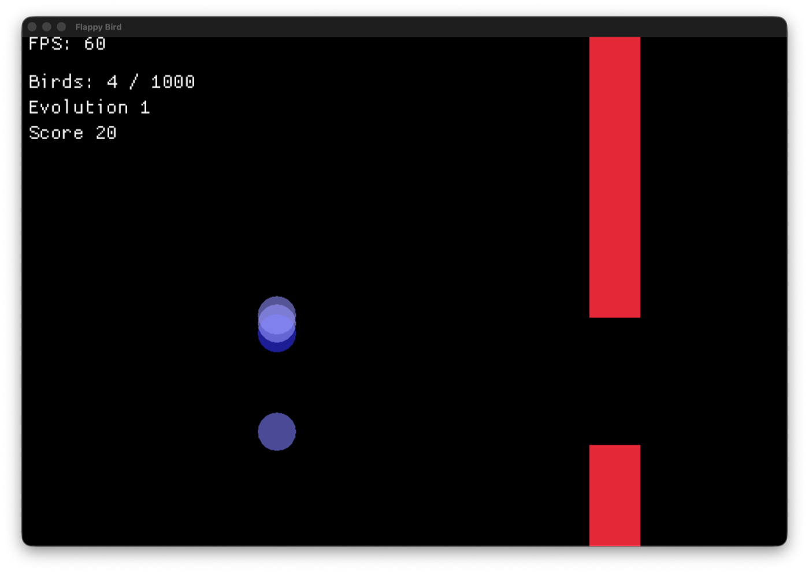

# Machine Learning from Scratch

I'm writing a small machine learning library in Rust without using any ML crates. No `tch`, no `candle`, no `ndarray`. Everything is built on `Vec<f32>` and math I work out myself.

I don't plan on publishing this. It exists so I can learn Rust and machine learning at the same time.

None of the code in this repository was written by AI. I type all of it myself. That's the point of the project, because code I didn't write is code I didn't learn anything from.

## What it does right now

It plays Flappy Bird. A thousand birds start with random weights and play the same pipe at the same time, and the ones that survive longest get to have children.

Generation 0, where the networks are still random:



Generation 1, after one round of selection and mutation:



No training data, no labels, no gradients. The birds that crash early just stop having children.

## How the evolution works

Every bird has a `5 → 10 → 1` network. It takes in the bird's height, its velocity, how far away the pipe is, the height of the gap, and the vertical distance between the bird and that gap. If the output comes out above 0 the bird flaps.

Once the last bird dies I sort them by how many frames they survived and keep the top 20 as parents. How many children a parent gets depends on where it ranked. Each parent passes on one exact copy of itself and the rest of its children get mutated.

There's a `bot_mode` flag in [`src/flappybird/mod.rs`](src/flappybird/mod.rs). Set it to false and you can play the game yourself with the spacebar.

The network code is in [`src/network.rs`](src/network.rs). Dense layers, a forward pass, tanh on the output, and the mutation function.

## What's next

I'm working on backprop at the moment, fitting a polynomial to a target curve with gradient descent before I try the same thing on the network.

After that, activation functions as an enum, loss functions and an optimizer, and then reinforcement learning, which is the part I'm most interested in.

## Running it

```bash
cargo run --release
```

Rust 2024 edition, macroquad for the rendering.
